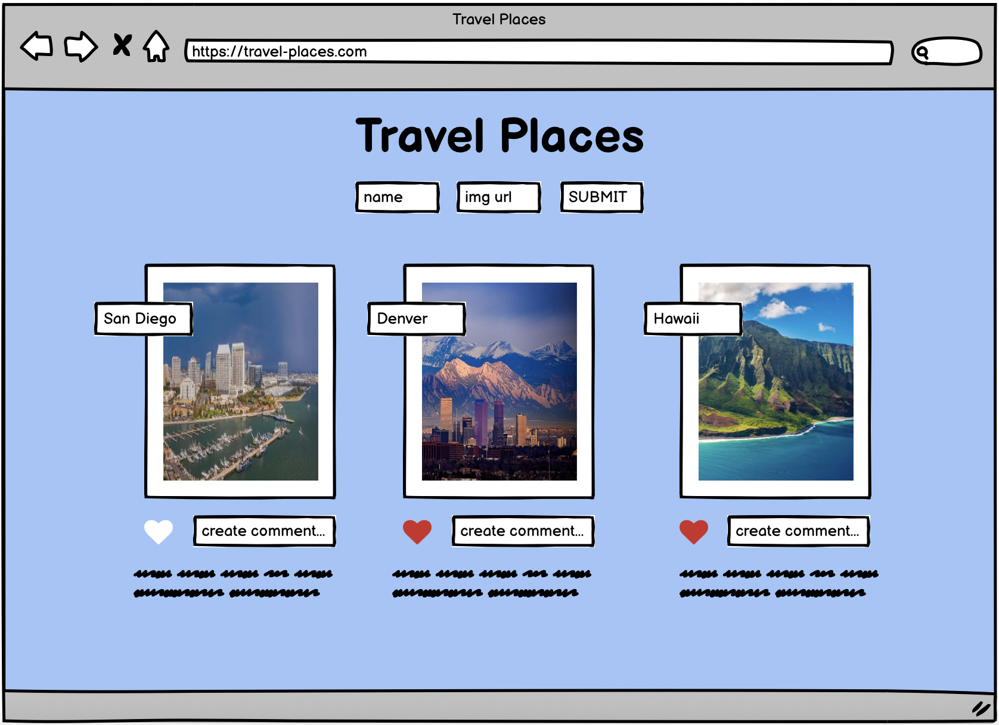

APP NAME: Travel Ratings

PITCH: 

This is going to be an app with travel places that a user can add a comment to or like the location 

USER STORIES:

As a user i want to be able to 

- [ x ] domContentLoaded alerts a welcome message to the screen, so I feel welcomed
- [ x ] Users submit a caption, so i can say what I want about a photo
- [ x ] Like a photo, so i can non-verbaly say I like the photo

WIREFRAME:

